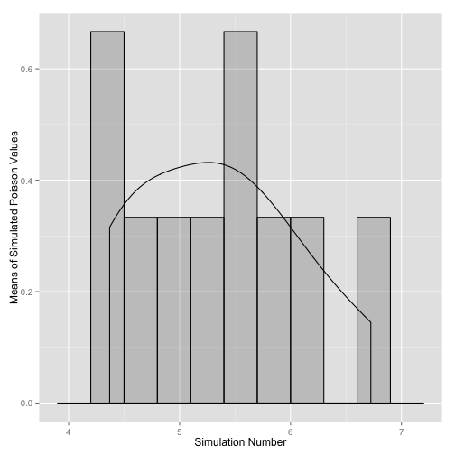
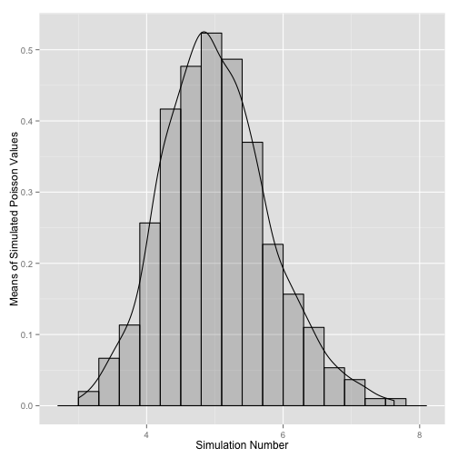

Data Products: Project
========================================================
author: Coursera Student
date: Tuesday, November 18, 2014

Central Limit Theorem & Law of Large Numbers; 
RStudio Presentation

Central Limit Theorem
========================================================
- The central limit theorem and the law of large numbers are the two fundamental theorems of probability. 
- Roughly, the central limit theorem states that the distribution of the sum (or average) of a large number of independent, identically distributed variables will be approximately normal, regardless of the underlying distribution. 

Example: 
Consider a Poisson distribution with a rate i.e. Lambda of 0.2 and a sample size of 40. The theoretical mean is 1/0.2 = 5. 

The theorem states that if we sample 40 observations from this distribution numerous times and take their means, the resulting distribution of these mean's would be normal. 

Central Limit Theorem - Plot
========================================================
For 10 simulations, notice that the plot is not close to normal. 


 

Central Limit Theorem - Plot (Cont'd.)
========================================================
For 1000 simulations however, notice that the plot is normal, as stated by the Central Limit Theorem.


 

Central Limit Theorem - Plot R Code
========================================================

```r
nosims = 1000; n = 40; expLambda = 0.2; par (mfrow = c(1,1))
simulatedExpValues = replicate(nosims, rexp (n, expLambda))
simulatedExponentialMeans = colMeans (simulatedExpValues)
meanOfSimExpMeans = mean(simulatedExponentialMeans)
g <- ggplot(data.frame(simulatedExponentialMeans), aes(x = simulatedExponentialMeans)) + 
    ylab("Means of Simulated Poisson Values") + xlab("Simulation Number") + 
    geom_histogram(alpha = 0.2, binwidth=0.3, colour = "black", aes(y = ..density..)) + geom_density()
g
```
